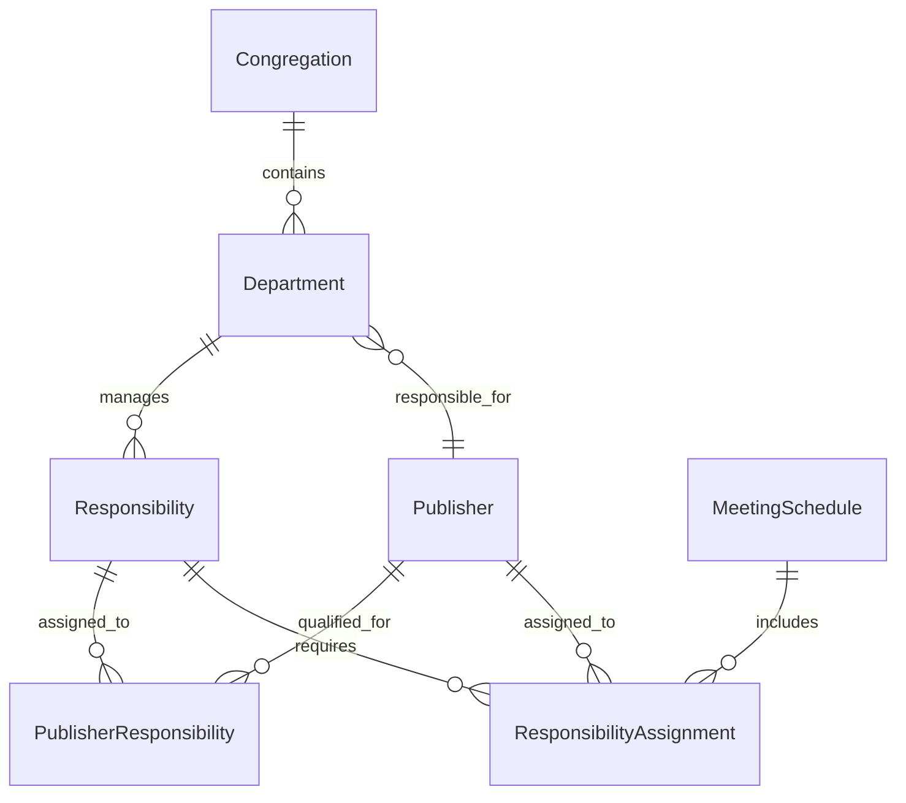

# Gestor Teocratico

[](https://dotnet.microsoft.com/)
[](https://www.postgresql.org/)
[](https://blazor.net/)
[](https://www.docker.com/)
[](LICENSE)
[](GestorTeocratico/Shared/PRD.md)

> A modern web application for comprehensive religious congregation management, built with ASP.NET Core Blazor Server and PostgreSQL.

---

## 📖 Table of Contents

- [Overview](#-overview)
- [Features](#-features)
- [Tech Stack](#-tech-stack)
- [Architecture](#-architecture)
- [Getting Started](#-getting-started)
- [Data Model](#-data-model)
- [Configuration](#-configuration)
- [API Documentation](#-api-documentation)
- [Contributing](#-contributing)
- [License](#-license)
- [Support](#-support)

---

## 📋 Overview

**Gestor Teocratico** is a comprehensive web application designed to streamline the administration of religious congregations. Built with modern web technologies, it provides an intuitive interface for managing congregation operations, from member administration to meeting scheduling and responsibility assignments.

### 🎯 Purpose

This application addresses the complex needs of religious congregation management by providing:

- **Centralized Management**: Single platform for all congregation administrative tasks
- **Role-Based Access**: Secure, hierarchical permission system for different user types
- **Automated Workflows**: Streamlined processes for common administrative tasks
- **Professional Reporting**: Generate PDF reports and export data for compliance
- **Real-time Dashboard**: Live metrics and insights for congregation leadership

### 🌟 Key Benefits

- **Efficiency**: Reduce administrative overhead with automated scheduling and assignments
- **Transparency**: Clear visibility into responsibilities and assignments for all members
- **Compliance**: GDPR-compliant data handling with audit trails and export capabilities
- **Scalability**: Designed to grow with your congregation's needs
- **Security**: Enterprise-grade authentication and data protection

## ✨ Features

### 🏛️ Congregation Management
- **Complete CRUD Operations**: Full congregation lifecycle management
- **Contact Information**: Centralized contact details and meeting schedules
- **Department Organization**: Hierarchical department structure with responsible publishers
- **Meeting Day Configuration**: Flexible scheduling for different years (even/odd)

### 👥 Publisher Administration
- **Member Profiles**: Comprehensive publisher records with personal information
- **Privilege Management**: Track and manage spiritual privileges (Elder, Ministerial Servant, Pioneer)
- **Department Assignments**: Flexible assignment system with role-based permissions
- **GDPR Compliance**: Personal data export and privacy-compliant data handling

### 📋 Responsibility Management
- **Department-Based Organization**: Responsibilities organized by congregation departments
- **Assignment Tracking**: Real-time visibility into current and historical assignments
- **Automated Scheduling**: Intelligent scheduling with conflict detection
- **Workload Balancing**: Fair distribution of responsibilities among qualified members

### �️ Meeting Scheduling
- **Interactive Calendar**: Drag-and-drop interface for easy schedule management
- **Responsibility Assignment**: Quick assignment of responsibilities to qualified publishers
- **Conflict Detection**: Automatic detection and prevention of scheduling conflicts
- **Multi-Meeting Support**: Handle both midweek and weekend meeting schedules

### 📊 Dashboard & Analytics
- **Real-time Metrics**: Live congregation statistics and health indicators
- **Performance Insights**: Track assignment patterns and member engagement
- **System Status**: Monitor application health and database connectivity
- **Quick Actions**: One-click access to common administrative tasks

### � Professional Reporting
- **PDF Generation**: High-quality PDF reports using QuestPDF
- **Monthly Schedules**: Professionally formatted meeting schedules
- **Custom Templates**: Branded documents with congregation information
- **Automated Distribution**: Direct download and email delivery capabilities

### 🔐 Security & Authentication
- **ASP.NET Identity**: Enterprise-grade authentication and authorization
- **Role-Based Access Control**: Granular permissions (Admin, Manager, User)
- **Data Protection**: Encrypted sessions and secure data handling
- **Audit Trails**: Comprehensive logging with soft-delete protection

### � Communication System
- **Email Notifications**: Automated notifications for assignments and updates
- **Account Management**: Secure account confirmation and password reset flows
- **Template-Based Messages**: Professional HTML and text email templates
- **Reliable Delivery**: Resend integration for high deliverability

## 🛠️ Tech Stack

### Backend Technologies
| Technology | Version | Purpose |
|------------|---------|---------|
| **ASP.NET Core** | 9.0 | Web framework and API hosting |
| **Entity Framework Core** | 9.0 | Object-relational mapping and database access |
| **PostgreSQL** | 17 | Primary database engine |
| **ASP.NET Identity** | 9.0 | Authentication and authorization |
| **QuestPDF** | 2025.7.0 | Professional PDF document generation |
| **Resend** | 0.1.5 | Email delivery service integration |

### Frontend Technologies
| Technology | Version | Purpose |
|------------|---------|---------|
| **Blazor Server** | 9.0 | Interactive web UI framework |
| **Radzen Blazor Components** | 7.1.6 | Professional UI component library |
| **SignalR** | 9.0 | Real-time web functionality |
| **CSS3 & HTML5** | Latest | Modern web standards |

### Infrastructure & DevOps
| Technology | Version | Purpose |
|------------|---------|---------|
| **Docker** | Latest | Containerization and deployment |
| **Docker Compose** | Latest | Multi-container orchestration |
| **Npgsql** | 9.0.4 | PostgreSQL driver for .NET |
| **Entity Framework Migrations** | 9.0 | Database schema versioning |

### Development Tools
- **Visual Studio / VS Code** - Primary development environment
- **Entity Framework Core Tools** - Database migration management
- **Docker Desktop** - Local containerization
- **Git** - Version control system

## 🏗️ Architecture

Gestor Teocratico follows a **Clean Architecture** pattern with clear separation of concerns and feature-based organization:

```
📁 GestorTeocratico/
├── 🎨 Components/              # Blazor UI Components
│   ├── Layout/                 # Application layouts and navigation
│   ├── Pages/                  # Feature-specific page components
│   │   ├── Administration/     # Admin-only management interfaces
│   │   ├── Congregation/       # Congregation management
│   │   ├── Department/         # Department administration
│   │   ├── MeetingSchedule/    # Meeting scheduling and assignment
│   │   ├── Publisher/          # Publisher management
│   │   └── Responsibility/     # Responsibility assignment
│   └── Account/                # Authentication and user management
│
├── 🔌 Features/                # Business Logic (Feature-based)
│   ├── Congregations/          # Congregation domain services
│   ├── Departments/            # Department management services
│   ├── MeetingSchedules/       # Meeting scheduling logic
│   ├── PdfExport/              # PDF generation services
│   ├── Publishers/             # Publisher management services
│   ├── Responsibilities/       # Responsibility assignment logic
│   ├── ResponsibilityAssignments/ # Assignment tracking
│   └── Roles/                  # Role and permission management
│
├── 💾 Data/                    # Data Access Layer
│   ├── ApplicationDbContext.cs # Entity Framework context
│   ├── Migrations/             # Database schema versions
│   ├── DataSeeder.cs           # Production data initialization
│   └── DataSeederDevelopment.cs # Development sample data
│
├── 🏛️ Entities/                # Domain Models
│   ├── Congregation.cs         # Congregation entity
│   ├── Department.cs           # Department entity
│   ├── Publisher.cs            # Publisher entity
│   ├── Responsibility.cs       # Responsibility entity
│   ├── MeetingSchedule.cs      # Meeting schedule entity
│   └── SoftDeleteEntity.cs     # Base entity with soft delete
│
├── ⚙️ Services/                # Cross-cutting Services
│   ├── ResendEmailSender.cs    # Email delivery service
│   └── ResendOptions.cs        # Email configuration
│
└── 🔧 Shared/                  # Common Utilities
    ├── Enums/                  # Application enumerations
    ├── Roles.cs                # Role constants
    └── PRD.md                  # Product requirements document
```

### 🏛️ Architecture Principles

- **Feature-Based Organization**: Services and components grouped by business domain
- **Dependency Injection**: Comprehensive IoC container for loose coupling
- **Repository Pattern**: Entity Framework Core as data access abstraction
- **CQRS Principles**: Clear separation between read and write operations
- **Domain-Driven Design**: Business logic encapsulated in domain services
- **Clean Code**: SOLID principles and separation of concerns

## 🚀 Getting Started

### 📋 Prerequisites

Before running Gestor Teocratico, ensure you have the following installed:

| Requirement | Version | Download Link |
|-------------|---------|---------------|
| **.NET SDK** | 9.0+ | [Download](https://dotnet.microsoft.com/download) |
| **Docker** | Latest | [Download](https://www.docker.com/get-started) *(Recommended)* |
| **PostgreSQL** | 17+ | [Download](https://www.postgresql.org/download/) *(If not using Docker)* |
| **Git** | Latest | [Download](https://git-scm.com/downloads) |

### 🐳 Quick Start with Docker (Recommended)

The fastest way to get started is using Docker Compose:

```bash
# 1. Clone the repository
git clone https://github.com/r3garciaz/GestorTeocratico.git
cd GestorTeocratico

# 2. Create environment file
cp .env.example .env
# Edit .env with your preferred settings

# 3. Start the application
docker compose up --build

# 4. Open your browser
# Navigate to: http://localhost:8080
```

### 💻 Local Development Setup

For local development without Docker:

```bash
# 1. Clone the repository
git clone https://github.com/r3garciaz/GestorTeocratico.git
cd GestorTeocratico

# 2. Create environment configuration
cat > .env << EOF
POSTGRES_DB=gestorteocratico
POSTGRES_USER=postgres
POSTGRES_PASSWORD=your_secure_password
POSTGRES_PORT=5432
ConnectionStrings__DefaultConnection="Host=localhost;Database=gestorteocratico;Username=postgres;Password=your_secure_password"
EOF

# 3. Restore .NET dependencies
dotnet restore

# 4. Setup database
cd GestorTeocratico
dotnet ef database update

# 5. Run the application
dotnet run

# 6. Open your browser
# Navigate to: https://localhost:7095
```

### 🔑 Default Login Credentials

For development environment, use these default credentials:

```
Email:    admin@gestorteocratico.com
Password: Admin123!
```

> **⚠️ Security Note**: Change the default password immediately in production environments.

### 🛠️ Development Environment Setup

```bash
# Install Entity Framework Core tools
dotnet tool install --global dotnet-ef

# Create a new migration (when making model changes)
dotnet ef migrations add YourMigrationName

# Update database with latest migrations
dotnet ef database update

# Generate development data
# Data seeding runs automatically on application start in Development mode
```

## 🗃️ Data Model

### 📊 Entity Relationship Overview



### 🏛️ Core Entities

| Entity | Description | Key Relationships |
|--------|-------------|------------------|
| **Congregation** | Main organizational unit with meeting schedules and basic information | Contains multiple Departments |
| **Department** | Organizational divisions within congregation (Audio/Video, Literature, etc.) | Has one responsible Publisher, contains multiple Responsibilities |
| **Publisher** | Congregation members with personal data and spiritual privileges | Can be responsible for Departments, qualified for multiple Responsibilities |
| **Responsibility** | Specific tasks or duties within departments | Belongs to one Department, can be assigned to multiple Publishers |
| **MeetingSchedule** | Individual meeting instances with date and type | Contains multiple ResponsibilityAssignments |
| **ResponsibilityAssignment** | Specific assignment of a responsibility to a publisher for a meeting | Links MeetingSchedule, Responsibility, and Publisher |

### 🔗 Key Relationships

- **Congregation → Department**: One-to-Many (A congregation has multiple departments)
- **Department → Publisher**: Many-to-One (A department has one responsible publisher)
- **Department → Responsibility**: One-to-Many (A department manages multiple responsibilities)
- **Publisher ↔ Responsibility**: Many-to-Many (Publishers can be qualified for multiple responsibilities)
- **MeetingSchedule → ResponsibilityAssignment**: One-to-Many (Each meeting has multiple assignments)

### �️ Data Protection Features

- **Soft Delete**: All entities implement logical deletion for data protection
- **Audit Trails**: Comprehensive logging of all data changes
- **GDPR Compliance**: Personal data export and right-to-be-forgotten implementation
- **Data Encryption**: Sensitive data protected with ASP.NET Data Protection

## 🔧 Configuration

### 🗄️ Database Configuration

Gestor Teocratico uses PostgreSQL as its primary database. Configure the connection string in `appsettings.json`:

```json
{
  "ConnectionStrings": {
    "DefaultConnection": "Host=localhost;Database=gestorteocratico;Username=postgres;Password=your_password;Port=5432"
  }
}
```

### 📧 Email Service Configuration

For email notifications, configure Resend integration:

```json
{
  "Resend": {
    "ApiToken": "your_resend_api_token",
    "FromEmail": "noreply@yourchurch.org"
  }
}
```

### 🌍 Environment Variables

Configure these environment variables for different deployment scenarios:

| Variable | Description | Required | Example |
|----------|-------------|----------|---------|
| `ConnectionStrings__DefaultConnection` | PostgreSQL connection string | ✅ | `Host=db;Database=gestorteocratico;Username=postgres;Password=secret` |
| `ASPNETCORE_ENVIRONMENT` | Application environment | ✅ | `Development`, `Staging`, `Production` |
| `RESEND__APITOKEN` | Resend email service API key | ❌ | `re_xxxxxxxxxx` |
| `RESEND__FROMEMAIL` | Default sender email address | ❌ | `noreply@yourchurch.org` |

### 🐳 Docker Environment

Create a `.env` file for Docker Compose:

```env
# Database Configuration
POSTGRES_DB=gestorteocratico
POSTGRES_USER=postgres
POSTGRES_PASSWORD=your_secure_password
POSTGRES_PORT=5432

# Application Configuration
ASPNETCORE_ENVIRONMENT=Development
ConnectionStrings__DefaultConnection=Host=database;Database=gestorteocratico;Username=postgres;Password=your_secure_password

# Email Configuration (Optional)
RESEND__APITOKEN=your_resend_api_token
RESEND__FROMEMAIL=noreply@yourchurch.org
```

### 🔒 Security Configuration

For production deployments:

1. **Strong Passwords**: Use complex passwords for database and admin accounts
2. **HTTPS**: Configure SSL certificates for secure connections
3. **API Keys**: Store sensitive API keys in secure key management systems
4. **Data Protection**: Configure data protection keys for encryption

```json
{
  "DataProtection": {
    "ApplicationName": "GestorTeocratico",
    "KeyLifetime": "90.00:00:00"
  }
}
```

## 📚 API Documentation

### 🔗 Available Endpoints

Gestor Teocratico provides both traditional MVC controllers and minimal API endpoints:

#### PDF Export Endpoints

```http
GET /meeting-schedules/monthly-schedule/{year}/{month}
```

**Description**: Generate and download a PDF schedule for a specific month and year.

**Parameters**:
- `year` (int): Year (2020-2030)
- `month` (int): Month (1-12)

**Response**: PDF file download

**Example**:
```bash
curl -X GET "https://localhost:7095/meeting-schedules/monthly-schedule/2024/12" \
     -H "Accept: application/pdf" \
     --output december-2024-schedule.pdf
```

#### Authentication Required

All API endpoints require authentication. Include authentication headers:

```http
Authorization: Bearer {your-jwt-token}
```

### 🔧 Service Interfaces

The application exposes well-defined service interfaces for programmatic access:

| Service | Interface | Purpose |
|---------|-----------|---------|
| **Congregation Management** | `ICongregationService` | CRUD operations for congregations |
| **Department Management** | `IDepartmentService` | Department administration |
| **Publisher Management** | `IPublisherService` | Publisher profile management |
| **Responsibility Management** | `IResponsibilityService` | Responsibility assignment |
| **Meeting Scheduling** | `IMeetingScheduleService` | Meeting and schedule management |
| **PDF Export** | `IPdfExportService` | Document generation |
| **Email Notifications** | `IEmailSender<ApplicationUser>` | Communication services |

### 📖 Integration Examples

#### PDF Export Integration

```csharp
// Inject the service
public class YourController : ControllerBase
{
    private readonly IPdfExportService _pdfService;
    
    public YourController(IPdfExportService pdfService)
    {
        _pdfService = pdfService;
    }
    
    // Generate PDF
    public async Task<IActionResult> GenerateSchedule(int year, int month)
    {
        var pdfBytes = await _pdfService.GenerateMonthlySchedulePdfAsync(month, year);
        return File(pdfBytes, "application/pdf", $"schedule-{year}-{month}.pdf");
    }
}
```

## 🤝 Contributing

We welcome contributions to Gestor Teocratico! This project follows standard open-source contribution practices.

### 🚀 Getting Started

1. **Fork the Repository**
   ```bash
   # Fork on GitHub, then clone your fork
   git clone https://github.com/YOUR_USERNAME/GestorTeocratico.git
   cd GestorTeocratico
   ```

2. **Set Up Development Environment**
   ```bash
   # Add upstream remote
   git remote add upstream https://github.com/r3garciaz/GestorTeocratico.git
   
   # Install dependencies
   dotnet restore
   
   # Set up database
   dotnet ef database update
   ```

3. **Create a Feature Branch**
   ```bash
   git checkout -b feature/your-feature-name
   ```

### 📝 Development Guidelines

#### Code Standards
- **C# Conventions**: Follow [Microsoft C# Coding Conventions](https://docs.microsoft.com/en-us/dotnet/csharp/fundamentals/coding-style/coding-conventions)
- **Entity Framework**: Use EF Core best practices and migrations
- **Async/Await**: Use async patterns for all I/O operations
- **SOLID Principles**: Maintain clean, testable code architecture

#### Commit Guidelines
We follow [Conventional Commits](https://www.conventionalcommits.org/):

```bash
# Feature additions
git commit -m "feat: add publisher assignment automation"

# Bug fixes
git commit -m "fix: resolve meeting schedule conflict detection"

# Documentation
git commit -m "docs: update API documentation"

# Refactoring
git commit -m "refactor: improve service layer organization"
```

#### Branch Naming
- `feature/feature-name` - New features
- `fix/bug-description` - Bug fixes
- `docs/documentation-update` - Documentation changes
- `refactor/code-improvement` - Code refactoring

### 🧪 Testing

```bash
# Run unit tests
dotnet test

# Run with coverage
dotnet test --collect:"XPlat Code Coverage"

# Integration tests (requires test database)
dotnet test --filter Category=Integration
```

### 📋 Pull Request Process

1. **Update Documentation**: Ensure README, API docs, and code comments are updated
2. **Add Tests**: Include unit tests for new functionality
3. **Update Migrations**: Include any database schema changes
4. **Check Build**: Ensure the application builds and runs successfully
5. **Create PR**: Use the provided PR template and link related issues

#### PR Template
```markdown
## Description
Brief description of changes

## Type of Change
- [ ] Bug fix
- [ ] New feature
- [ ] Breaking change
- [ ] Documentation update

## Testing
- [ ] Unit tests added/updated
- [ ] Integration tests pass
- [ ] Manual testing completed

## Screenshots (if applicable)
[Add screenshots for UI changes]
```

### 🐛 Reporting Issues

When reporting issues, please include:

- **Environment**: OS, .NET version, browser (if applicable)
- **Steps to Reproduce**: Clear, numbered steps
- **Expected Behavior**: What should happen
- **Actual Behavior**: What actually happens
- **Screenshots**: Visual evidence (if applicable)
- **Logs**: Relevant error logs or stack traces

### 💡 Feature Requests

For feature requests:
1. Check existing issues to avoid duplicates
2. Use the feature request template
3. Provide clear use cases and benefits
4. Consider implementation complexity

### 🏆 Recognition

Contributors will be recognized in:
- GitHub contributors list
- Release notes for significant contributions
- Special mentions for outstanding contributions

Thank you for helping make Gestor Teocratico better! 🙏

## 📜 License

This project is licensed under the **MIT License** - see the [LICENSE](LICENSE) file for details.

### MIT License Summary
- ✅ **Commercial use** - Use in commercial projects
- ✅ **Modification** - Modify the source code
- ✅ **Distribution** - Distribute copies
- ✅ **Private use** - Use privately
- ❌ **Liability** - No warranty or liability
- ❌ **Warranty** - No warranty provided

## 📞 Support

### 🆘 Getting Help

| Support Type | Channel | Response Time |
|--------------|---------|---------------|
| **Bug Reports** | [GitHub Issues](https://github.com/r3garciaz/GestorTeocratico/issues) | 1-3 business days |
| **Feature Requests** | [GitHub Discussions](https://github.com/r3garciaz/GestorTeocratico/discussions) | 1 week |
| **Documentation** | [Project Wiki](https://github.com/r3garciaz/GestorTeocratico/wiki) | Self-service |
| **General Questions** | [GitHub Discussions](https://github.com/r3garciaz/GestorTeocratico/discussions) | Community support |

### 📚 Documentation Resources

- **📋 [Product Requirements Document](GestorTeocratico/Shared/PRD.md)** - Comprehensive product specifications
- **🏗️ [Architecture Guide](docs/ARCHITECTURE.md)** - Technical architecture details
- **🚀 [Deployment Guide](docs/DEPLOYMENT.md)** - Production deployment instructions
- **🔧 [API Reference](docs/API.md)** - Complete API documentation

### 🐛 Reporting Issues

Before creating an issue, please:
1. Check [existing issues](https://github.com/r3garciaz/GestorTeocratico/issues)
2. Search [closed issues](https://github.com/r3garciaz/GestorTeocratico/issues?q=is%3Aissue+is%3Aclosed)
3. Review the [troubleshooting guide](docs/TROUBLESHOOTING.md)

### 💬 Community

- **Discussions**: Share ideas and ask questions
- **Wiki**: Community-maintained documentation
- **Contributing**: Help improve the project

---

## 📈 Project Status

### 🏗️ Current Development Phase

**Version**: `v1.0.0-beta` | **Status**: `Active Development` | **Stability**: `Beta`

### ✅ Implemented Features

| Feature Category | Status | Completion |
|------------------|--------|------------|
| **Core Management** | ✅ Complete | 100% |
| **Authentication & Security** | ✅ Complete | 100% |
| **PDF Export System** | ✅ Complete | 100% |
| **Email Notifications** | ✅ Complete | 100% |
| **Dashboard & Analytics** | ✅ Complete | 100% |
| **Role-based Access Control** | ✅ Complete | 100% |
| **Data Protection & GDPR** | ✅ Complete | 100% |
| **Docker Deployment** | ✅ Complete | 100% |

### 🚧 Roadmap & Upcoming Features

#### 🎯 Phase 2 - Enhanced User Experience (Q1 2025)
- [ ] **Advanced Dashboard**: Enhanced metrics and analytics
- [ ] **Mobile Responsive UI**: Improved mobile experience
- [ ] **Bulk Operations**: Mass assignment and import capabilities
- [ ] **Advanced Search**: Global search with filters and sorting

#### 🌐 Phase 3 - Integration & APIs (Q2 2025)
- [ ] **REST API**: Complete RESTful API for external integrations
- [ ] **Webhook Support**: Real-time notifications for external systems
- [ ] **Calendar Integration**: Google Calendar and Outlook synchronization
- [ ] **Mobile App**: Native mobile application

#### 🔮 Phase 4 - Advanced Features (Q3 2025)
- [ ] **Multi-language Support**: Full internationalization (i18n)
- [ ] **AI-Powered Scheduling**: Intelligent assignment recommendations
- [ ] **Multi-congregation Support**: Support for multiple congregations
- [ ] **Advanced Reporting**: Custom report builder and analytics

#### 🎨 Phase 5 - Customization & Extensibility (Q4 2025)
- [ ] **Theme Customization**: Configurable UI themes and branding
- [ ] **Plugin System**: Extensible architecture for custom features
- [ ] **Advanced Permissions**: Fine-grained permission management
- [ ] **Cloud Deployment**: One-click cloud deployment options

### 📊 Development Metrics

- **Code Coverage**: `85%+`
- **Build Status**: []()
- **Security**: []()
- **Dependencies**: []()

### 🔄 Release Cycle

- **Major Releases**: Quarterly (every 3 months)
- **Minor Releases**: Monthly feature updates
- **Patch Releases**: As needed for bug fixes
- **Security Updates**: Immediate as required

### 🎯 Success Metrics

- **Performance**: Sub-second page load times
- **Reliability**: 99.9% uptime target
- **User Satisfaction**: Regular user feedback incorporation
- **Security**: Zero critical vulnerabilities

---

**Built with ❤️ for efficient religious congregation management**

*Gestor Teocratico - Streamlining congregation administration through modern technology*
